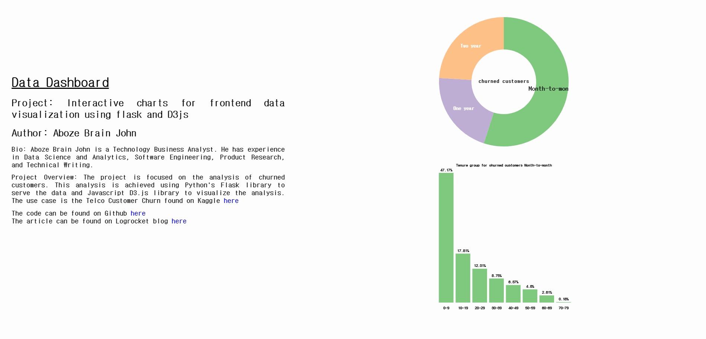
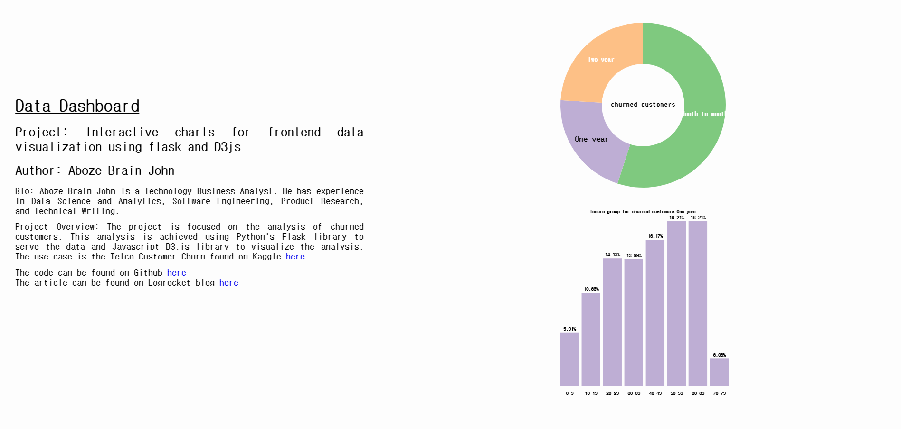

## Flask & D3 통합 실습

## Flask와 D3를 함께 사용해야 하는 이유
- Flask와 D3.js를 통합하면, Flask가 서버에서 데이터를 처리하고 API를 통해 클라이언트로 데이터를 전달하며, D3.js는 전달받은 데이터를 기반으로 시각적으로 표현하는 강력한 웹 애플리케이션을 구현 가능
- Flask의 가벼운 백엔드 처리와 D3.js의 강력한 데이터 히각화 기능을 결합하여, 데이터 처리와 시각화가 일관되게 이루어지는 웹 애플리케이션을 구축하는데 적합

## Flask & D3 통합 데이터 처리 및 시각화 앱의 구조
- Flask는 서버에서 데이터를 처리한 후, 클라이언트로 전달하여 시각화를 담당하는 D3와 통합
- app.py는 Flask 인스턴스를 포함하는 핵심 Python 스크립트로, 애플리케이션의 진입점, 라우팅, 그리고 엔드포인트를 정의
- 서버는 클라이언트의 요청을 처리하고, 전처리된 데이터를 클라이언트에 제공
- Flask 애플리케이션에서 Python의 Pandas와 Numpy 라이브러리를 사용해 데이터를 전처리 후, JSON 형식으로 변환하여 index.html 파일로 전달해 D3.js로 시각화

## 프로젝트 구조
```bash
Project
    ├── modules
    │   └── data_processing.py
    │
    ├── static
    │   └── css
    │       └── style.css
    │   └── data
    │       └── Churn_data.csv
    │   └── js
    │       ├── barChart.js             # 바 차트를 렌더링하기 위한 함수형 코드
    │       ├── index.js                # 대시보드에 차트를 렌더링하는 메인 스크립트를 포함하며, 
    │       │                             각 차트 렌더링 함수들을 실행하는 역할
    │       ├── pieChart.js             # 파이 차트를 렌더링하기 위한 함수형 코드
    │       └── updateBarChart.js       # 파이 차트의 선택(클릭) 인터랙션을 기반으로
    │                                     바 차트를 업데이트하는 함수
    │
    ├── tempates
    │   └── index.html # 두 개의 변수 pieChartDataUrl 과 barChartDataUrl 을 사용하여 라우팅 URL을 통해 JSON 응답 데이터를 가져와 차트를 렌더링하는 템플릿
    │
    │
    ├── app.py
    ├── README.md
    └── requirements.txt                # 프로젝트의 필수 패키지 목록
```

## 실행 방법
1. 가상환경 생성
    ```bash
    python -m venv venv
    ```
2. 가상환경 활성화
    ```bash
    venv\Scripts\activate
    ```
3. 의존성 설치
    ```bash
    pip install -r requirements.txt
    ```
4. 웹 시스템 실행
    ```bash
    python app.py
    ```
브라우저에서 http://localhost:5000으로 접속하여 시스템을 확인할 수 있다.

## 결과



파이차트를 통해 계약 유형별 고객 이탈 비율을 제공하고, 막대 차트를 통해 계약 유형 내 가입 기간 그룹별 고객 이탈 비율을 제공한다.
